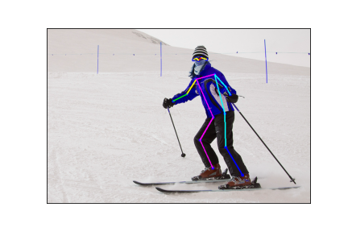

# 姿勢推定タスク  
実行結果: 
  
データセット: [https://www.kaggle.com/awsaf49/coco-2017-dataset](https://www.kaggle.com/awsaf49/coco-2017-dataset)  
モデル: [OpenPose](https://arxiv.org/abs/1812.08008)  
使い方:  
モデルのダウンロードする[https://drive.google.com/file/d/1BjA2NxpdlBijZl8Zp4m_Du28687FFCna/view?usp=sharing](https://drive.google.com/file/d/1BjA2NxpdlBijZl8Zp4m_Du28687FFCna/view?usp=sharing)  
ダウンロードしたモデルを`models/`に配置する  
```
$ python predict_pose.py 1.jpg  # model openpose
$ python predict_rcnn.py 1.jpg # model keypointRCNN_resnet50_fpn
```  

応用: 姿勢推定された画像を入力データとして、`TripletLoss`を用いたコサイン類似度ベクトルによる異常検知。または、画像分類。さらに姿勢を学習するとした疑似的なキャラクターへの画像生成の応用。
